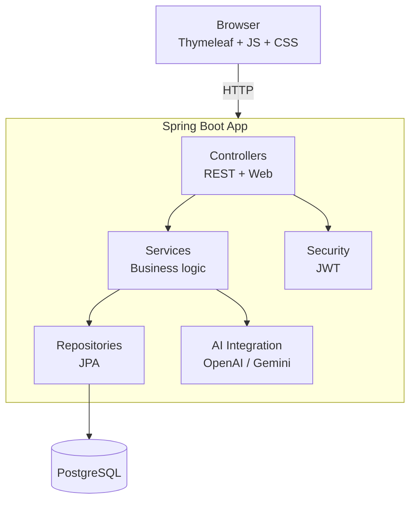
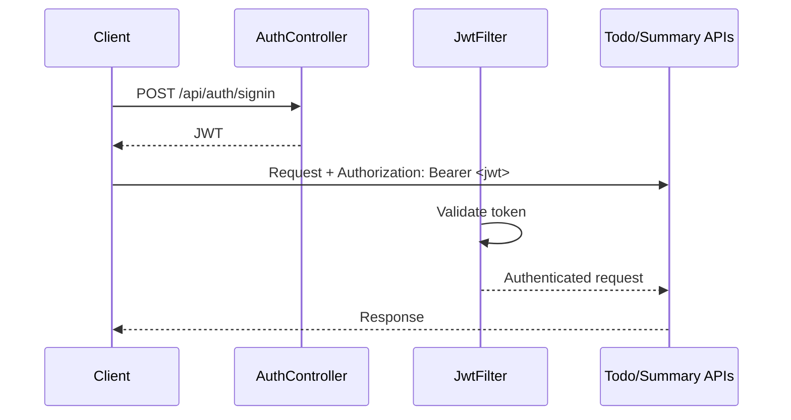
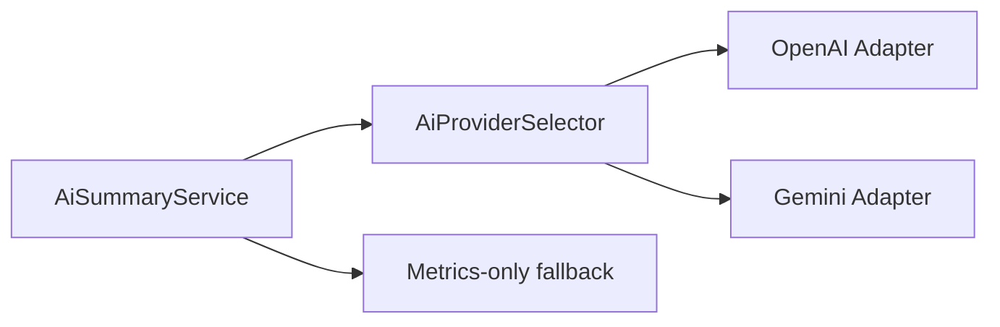
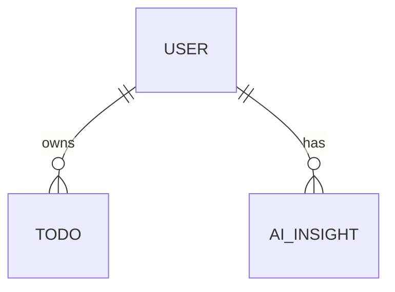
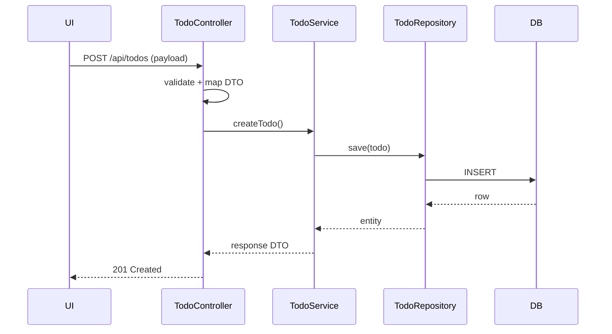
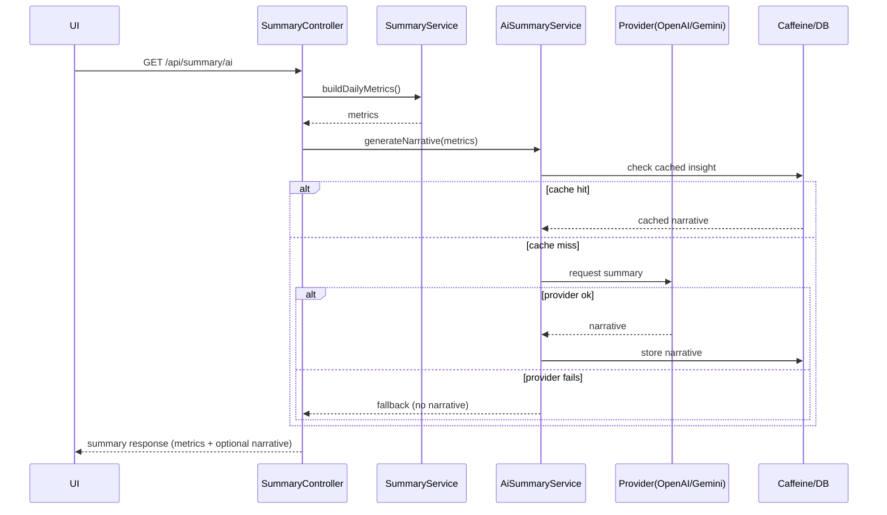

# Todo Insight - Design Notes

A simple design overview of the Todo Insight application architecture and the main choices behind it.

---

## 1. Overview

Todo Insight is a full-stack todo app with a normal todo workflow (CRUD) and an optional AI summary feature. It uses a straightforward Spring Boot layered structure to keep the code easy to navigate and maintain.

---

## 2. Architecture

### High-level view



### Package structure

```
org.duckdns.todosummarized/
├── config/         # Security, cache, API configs
├── controller/     # REST + web controllers
├── domains/
│   ├── entity/     # JPA entities (User, Todo, AiInsight)
│   └── enums/      # Status, Priority, Role
├── dto/            # Request/Response DTOs + mapping
├── exception/      # Global error handling
├── ratelimit/      # Rate limit (AOP)
├── repository/     # Spring Data JPA repositories
└── service/        # Business logic
```

---

## 3. Core design decisions

### 3.1 Layered structure

Keep responsibilities clear:

* Controller: HTTP handling + validation + mapping
* Service: business rules + transactions
* Repository: database access
* Entity: persistence model

### 3.2 Security (JWT)

JWT for API endpoints. Token is validated on each request.



### 3.3 AI integration

AI is optional and designed to fail safely (fallback to metrics-only).



Notes:

* Provider selection is centralized (one place to choose).
* If AI is down, return a summary based on stored metrics instead of erroring.
* Cache AI results to reduce cost and latency.

### 3.4 Data model

User-owned todos, plus stored AI insight records.



---

## 4. Workflows

### 4.1 Create todo


  

### 4.2 Generate AI summary (with fallback)



---

## 5. API surface

| Method | Endpoint        | Purpose                                 |
| ------ | --------------- | --------------------------------------- |
| GET    | /api/todos      | List todos (paginated)                  |
| POST   | /api/todos      | Create todo                             |
| PUT    | /api/todos/{id} | Update todo                             |
| DELETE | /api/todos/{id} | Delete todo                             |
| GET    | /api/summary/ai | Metrics summary + optional AI narrative |

Error handling stays consistent via a global exception handler:

* 400 validation issues
* 401/403 auth issues
* 404 not found
* 500 unexpected errors

---

## 6. Cross-cutting concerns

* Rate limiting: simple AOP guard on expensive endpoints (like summary generation)
* Caching: cache AI summaries, still store the deterministic metrics
* Validation: Bean Validation on request DTOs
* Logging: log important failures (AI provider errors, auth failures), avoid logging secrets/tokens

---

## 7. Tech choices

* Spring Boot: strong defaults, easy testing, common patterns
* PostgreSQL: reliable relational storage
* Thymeleaf + Vanilla JS: simple delivery, no frontend build pipeline
* JWT: stateless API auth
* Caffeine: fast local caching

---

## Summary

The design stays simple:

* standard Spring layering
* JWT auth for API
* AI is optional and isolated behind a small interface
* fallback behavior keeps the app usable even when AI fails
* caching reduces cost and response time
